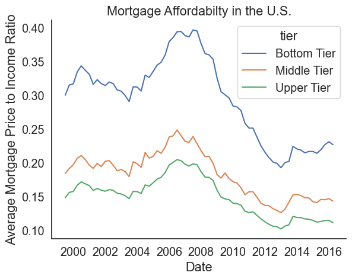
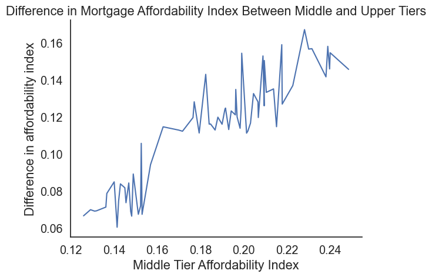
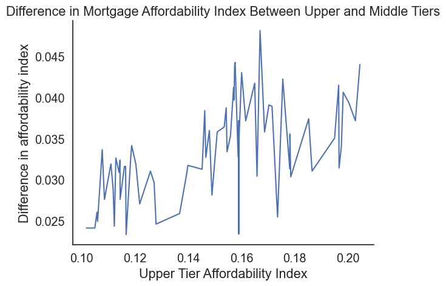

# Group 30 - Mortgage Affordabilty Analysis

*"Helping future home buyers one cell at a time"*

## The dataset

Our dataset is on mortgage affortability in the US with data from 1999-2016. The dataset was found on data.world and data is from Zillow. The dataset shows the percentage of income spent on a mortgage, data is organized quarterly and is calcualted as a part of Zillow’s quarterly Affordability Indices. To calculate mortgage affordability, Zillow calculates the mortgage payment for the median-valued home in a metropolitan area by using the metro-level Zillow Home Value Index for a given quarter and the 30-year fixed mortgage interest rate during that time period based on a 20 percent down payment. Then they consider what portion of the monthly median household income (U.S. Census) goes toward this monthly mortgage payment. Data is organized by metropolitan area and considers bottom, middle, and top tier homes/incomes. Zillow is a tech real-estate marketplace so the reason for data collection is quite trivial, they collect and analyze real estate data to provide valuable insights to home buyers and sellers. Data was collected by means of Freddie Mac Primary Mortgage Market Survey for mortage rates and the US Census for average monthly income. 

## Introduction

A common interest theme that appeared when discussing this dataset among team members is that it is relatively actual to our generation. Skyrocketing home prices since Covid as well as never-ending interest rate spikes have driven home affordability incredibly low. This mortage affordability dataset covers the US up to 2017 and contains relevant information as first-time home buyers in Canada are facing an unprecedented real estate market. Additionally, the large scale of this dataset offers a lot of research angles, leaving a lot of flexibility for our group to conduct a data science project. 

Throughout this data analysis project we wil discuss a variety of factors which affect and/or relate to mortgage affordability as well as our findings. Such findings stem from the influence of population size, state or region and/or its location, the difference between different class levels of US citizens and the result of time. 

## Exploratory Data Analysis Highlights 

During our exploratory data analysis, our aim was to gain a comprehensive understanding of the national growth rate for the house affordability ratio. We achieved this by examining the "United States overall" row, which calculates the average for each date and tier across all regions within the dataset. To visualize these findings, we employed pandas, numpy, matplot and seaborn to create a modified dataset and generate a linear graph. This graph featured three linear trends representing the bottom, middle, and upper tiers.

Throughout our project, each group member explored whether city population effected the affordability of the mortgages within the city in question. Each of our seperate findings yielded the same conclusion - there is no correlation between how populated an area is and the affordability mortgages in said area by the information within our dataset. Each of us made visualizations depicting the lack or correlation, an example of which can be seen below.

## Question 1

Given that our dataset contains regional data organized by states, we found it compelling to aggregate each region by its corresponding state and compute the average mortgage affordability ratio for comparison. This led us to the following research question: **What are the variations in affordability ratios across different states, and what factors could account for these disparities?**. To investigate this question, we will delve further into choropleth visualizations, enabling us to effectively illustrate the distribution of housing affordabililty ratios in the United States over time.

The choropleth provides an immediate understanding of the mortgage affordability ratio concentration within each state. We observe significant disparities among the states, which we further analyze using a bar plot for numerical visualization:

The initial visualizations reveal that California has the highest affordability ratio, indicating a less favorable situation. There is a substantial gap between California and the next highest state, Massachusetts. To represent the evolution of affordability ratios by state, we generated a time series line plot, which allows us to track changes in affordability ratios for each state throughout the years.

We can see that affordability ratios have experienced fluctuations over time, with some periods exhibiting more pronounced changes than others. Certain states display similar trends, including a spike in affordability ratios between 2006 and 2008, while others exhibit unique patterns.

The affordability ratio varies widely across states, and these differences can be attributed to a variety of factors not directly evident in the graphs. Such factors include regional economic conditions, local housing markets, and state-level policies. As established in our first research question, population rank does not significantly impact the affordability ratio, even at the state level. By examining the visualizations, we can discern common trends and patterns among regions, characterized by distinct spikes and drops (where spikes are unfavorable and drops are favorable) over the years.

## Q2: Has the affordability of a mortgage changed over the 17 year period that the data was collected? If so, did affordability increase or decrease?

By finding the average affordability for each year across the entire dataset, we were able to look at the data from a more holistic perspective. Instead of analyzing subsections of the data, by looking at the collective trend of all of the data as a whole, we were able to analyze the overall increase or decrease in affordability over time.

To begin our analysis, the average affordability for each year was graphed in a bar graph to create the first visualization of any trends that might exist within our timeline. By this visualization, it could be easily seen that there was a lot of variance within the affordability timeline. There was an apparent global maximum, or point of least affordability, in the year 2006. There was an apparent global minimum, or point of most affordability, in the year 2012. Despite the many trends we could see within this visualization, it was still hard to determine the overall trend of the data. This is where the next graph shined in comparison.

This line plot was able to display the same trends as the previous histogram with ease, but in addition it has a much cleaner look when a best fit line is added. The best fit line included in this lineplot shows us the overall liner trend of the average affordability across the entire 17 year period. Using this plot, it is easy to see that the overall trend of the affordability over time is to become increasingly more affordable, at least within our 17 year period.

Going into this project, one might have assumed that mortgages overall would be becoming less affordable overtime, but through our analysis we were able to determine the opposite. From a personal perspective, this data may provide home buyers with more hope for the market. From a global point of view, it would be interesting to compare these results to the overall affordability changes in other countries over the same time period. It would also be interesting to see how the overall affordability trends found in our data compare to more recent years considering the economic effect of the COVID-19 pandemic, which happened in later years than our dataset includes.

## Q3: How does mortgage afforability change with time for differnt tiers? Do all tiers follow the same trend or do they have their own? If they do, (as one tier goes up/down so does the other) is it a constant relationship (change at same rate) or not (e.i. as one increases/decreases does the other increase/decrease more/less rapidly)

This visualization really shows the trend of mortgage affordability over time. This plot makes it easy to visualize the first two parts of the question and answer them. As for the first part, although there are many factors to consider, many of which is not seen in the data, the plot does indicate how some factors influence mortgage affortability. The most obvious factor here which is clear to see is the 2008 housing market crash which correlates to the maximums in the plot for all tiers. Also we see a big difference in the affordability index between the tiers, indicating homes are typaclly less affordable for lower income residences. As for the second part of the question, we can clearly see the same shape/trend across all tiers.

Now lets dive in to the last part of the quetion and see if we have a constant relationship or not between the different tiers.

| Upper Class vs. Middle class | Middle Class vs. lower CLass |
|:----------------------------:|:----------------------------:|
 | |

On the two plots we can see a general upward trend. Although small, this implies that as homes become less affordable for a certain tier, they become increasinly less affordable for lower tier americans. We also see a bigger difference, or steeper slope when the bottom tier is compared. These observations can point to several factors. For instance one reason that lower class americans are affected the most, and probably for worse, could be how minimum wages are not typacally livable so majority of income or a less perferable amount is spent on housing. 

## Analysis Links

If you are further interested in data science and would like to check out our in-depth analysis and code, you can find below the link to our three separate analyses:

[Angelina](/analysis/analysisAngelina.ipynb)
[Alrick](/analysis/analysisAlrick.ipynb)
[Will](/analysis/analysisWill.ipynb)

## References

All Data, raw and refined, is attributed to Zillow Group, inc.
